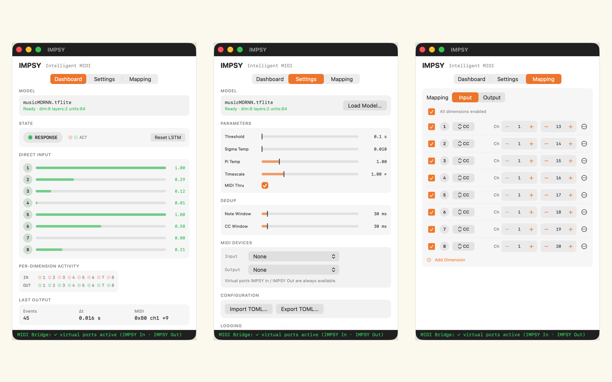

# IMPSY AUv3

An AUv3 MIDI Processor plugin that runs the [IMPSY](https://github.com/cpmpercussion/impsy) intelligent musical instrument system on iOS and macOS. Load a TFLite MDRNN model and interact with it in call-and-response mode inside any AUv3 host (AUM, ApeMatrix, Logic Pro, etc.).

**[Download IMPSY on the App Store](https://apps.apple.com/app/id6771762122)** — available for iOS 17+ and macOS 14+ (Apple Silicon).



## What it does

- Listens to incoming MIDI messages and normalises them to the IMPSY model's input dimensions
- Runs in **call-and-response mode**: when you pause playing, the RNN generates MIDI responses; when you play, the RNN listens
- Each model dimension maps to a configurable MIDI message (Note On, CC, or Pitch Bend) — inputs and outputs mapped independently, importable/exportable as TOML compatible with the IMPSY Python toolkit
- Ships with a bundled 9-dimensional default model, and loads any `.tflite` IMPSY model (dimension and layer count are read from the model file)
- The host apps also run **standalone**: they publish `IMPSY In` / `IMPSY Out` Core MIDI virtual ports and connect directly to MIDI hardware, so IMPSY can be played without a DAW (or route DAWs that don't host `aumi` plugins, like Ableton Live, through it)
- Optionally records **session logs** in the IMPSY Python `.log` format, ready for the IMPSY training pipeline

## Requirements

- Xcode 16+
- iOS 17+ / macOS 14+ (macOS is Apple Silicon only)
- [xcodegen](https://github.com/yonaskolb/XcodeGen) for project generation
- Optional: extra TFLite IMPSY models (e.g. from `../impsy/models/`) — a default 9-dimensional model is bundled

## Setup

### 1. Install xcodegen

```bash
brew install xcodegen
```

### 2. Generate the Xcode project

```bash
cd impsy-auv3
xcodegen generate
```

### 3. Build the TensorFlow Lite xcframework

TFLite is vended through `Packages/TensorFlowLite`, a local Swift package wired up by xcodegen. The binary `TensorFlowLiteC.xcframework` is not committed — assemble it once after cloning (and again after any change to the script):

```bash
./scripts/build_tflite_xcframework.sh
```

The script combines kewlbear's iOS `TensorFlowLiteC` slices with a macOS arm64 slice repacked from `tphakala/tflite_c`. Xcode Cloud runs it automatically via `ci_scripts/ci_post_clone.sh`.

### 4. Configure signing

Open `IMPSY-AUv3.xcodeproj` in Xcode and set your Development Team for all four targets:
- `IMPSYHost-iOS`
- `IMPSYHost-macOS`
- `IMPSYExtension-iOS`
- `IMPSYExtension-macOS`

### 5. Build and run

Select the `IMPSYHost-iOS` scheme and run on your iPad, or `IMPSYHost-macOS` for Mac. The AUv3 extension will be registered and available in hosts like AUM.

## Usage

1. A bundled 9-dimensional model loads by default; load another `.tflite` model with the **Load Model** button (Files on iOS, Finder on macOS)
2. Configure MIDI input/output mappings for each dimension, or import a TOML config from the IMPSY Python toolkit
3. Adjust parameters (threshold, temperatures, timescale, MIDI thru, dedup windows)
4. Route MIDI in and out in your AUv3 host — or run the host app standalone and use the `IMPSY In` / `IMPSY Out` virtual MIDI ports
5. Optionally enable **Record Session Logs** to capture performances in IMPSY's `.log` training format

## IMPSY Model Files

Additional IMPSY models are in `../impsy/models/`. Recommended starting model:
```
musicMDRNN-dim9-layers2-units64-mixtures5-scale10.tflite
```

## Parameters

| Parameter | Range | Default | Description |
|-----------|-------|---------|-------------|
| Threshold | 0.1–10s | 0.1s | Silence duration before RNN starts responding |
| Sigma Temp | 0.001–2.0 | 0.01 | Controls Gaussian sampling variance |
| Pi Temp | 0.1–5.0 | 1.0 | Controls mixture component diversity |
| Timescale | 0.1–4.0× | 1.0× | Multiplies predicted time deltas |
| MIDI Thru | on/off | on | Re-emits your own mapped input through the output mappings |

Two further settings (not in the AU parameter tree, but saved with the session) suppress duplicate output: the **Note** and **CC dedup windows** (0–500 ms, default 30 ms; 0 disables).

## Architecture

```
MIDI In → scheduleMIDIEventBlock → RingBuffer → InteractionEngine
                                                      ↓
                                               TFLiteRNN.generate()
                                                      ↓
                                               MDNSampler.sample()
                                                      ↓
                                         RingBuffer → internalRenderBlock
                                                      ↓
                                              midiOutputEventBlock → MIDI Out
```

See `CLAUDE.md` for full architectural details (threading model, model tensor conventions, state persistence).

## Tests

Unit tests run on macOS; UI tests drive the host apps on both platforms:

```bash
# Unit tests only
xcodebuild test -project IMPSY-AUv3.xcodeproj -scheme IMPSYHost-macOS -destination 'platform=macOS' -only-testing:IMPSYTests

# Smoke + UI tests
./scripts/smoke.sh                  # ios + macos smokes + all UI tests
./scripts/smoke.sh tests macos      # just macOS UI tests
```
